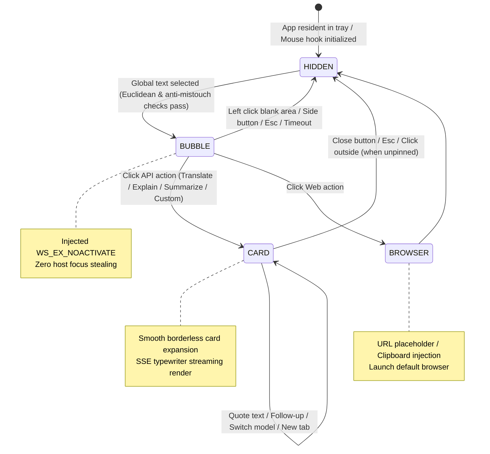

# IOX

<p align="center">
  
</p>

<p align="center">
  <strong>Lightning-fast, lightweight, and non-intrusive Windows global text-selection AI assistant & desktop productivity engine.</strong>
</p>

<p align="center">
  <a href="./README.md"><strong>English</strong></a> •
  <a href="./README_zh.md">简体中文</a>
</p>

<p align="center">
  <a href="https://tauri.app/"></a>
  <a href="https://www.rust-lang.org/"></a>
  <a href="https://react.dev/"></a>
  <a href="https://www.typescriptlang.org/"></a>
  <a href="https://tailwindcss.com/"></a>
  <a href="LICENSE"></a>
  
</p>

<p align="center">
  <a href="#-key-features">Key Features</a> •
  <a href="#-system-architecture">Architecture</a> •
  <a href="#-quick-start">Quick Start</a> •
  <a href="#-configuration-guide">Configuration</a> •
  <a href="#-roadmap">Roadmap</a> •
  <a href="#-license">License</a>
</p>

---

## 📖 Introduction

**IOX** is a next-generation global text-selection AI assistant designed specifically for Windows. Built on **Tauri v2 + Rust + React 19**, IOX integrates large language model capabilities seamlessly into your daily reading, coding, and writing workflows with sub-millisecond responsiveness, minimal memory footprint, and a non-intrusive user experience.

Whether you are in a browser, code editor, PDF viewer, or office suite, simply select any text, and IOX instantly brings up a minimalist capsule bubble or an expandable streaming card beside your cursor—supporting in-place streaming answers, translations, code explanations, DeepSeek R1 reasoning chain visualization, and one-click direct navigation to major AI web portals.

---

## ✨ Key Features

### 🖱️ 1. Global Non-Intrusive Text Selection & Bubble Bar
* **Instant Selection Response**: Utilizes a native Windows low-level mouse hook (`WH_MOUSE_LL`) to detect text selection and release events with zero lag, popping up a sleek capsule bubble bar right beside your cursor.
* **Icon-Only Minimalist Mode**: Supports switching to an ultra-clean icon-only mode to minimize visual distraction.
* **Smart Boundary Avoidance & Drag Awareness**: Automatically adjusts positioning based on cursor coordinates, screen edges, and HiDPI scaling factors to never obscure selected text.

### 🛡️ 2. Zero Focus Stealing & Native Anti-Mistouch
* **`WS_EX_NOACTIVATE` Zero Focus Stealing**: The floating bubble window is injected with the Windows `WS_EX_NOACTIVATE` extended style, **never stealing focus from the host application**. Your highlighted text selection and cursor position stay intact.
* **Quadruple Anti-Mistouch Filter**:
  * **Euclidean Distance Check**: Accurately differentiates between simple clicks and text selection drags;
  * **Valid Character & Whitespace Filter**: Ignores pure whitespace or meaningless ultra-short selections;
  * **Modifier Key Filter**: Suppresses unintended triggers during system operations involving `Ctrl`, `Shift`, `Alt`, or `Win` keys;
  * **Process Blacklist with Quick Picker**: Built-in blacklist filtering with an intuitive mouse picker to easily select and blacklist target app windows.

### 📋 3. Zero-Pollution Safe Clipboard Recovery
* **Seamless Clipboard Protection**: When text extraction is triggered, IOX creates an in-memory backup of your system clipboard, simulates a millisecond-level `Ctrl+C` to copy the selected text, and **immediately restores the original clipboard content**—preserving your copy-paste history seamlessly.

### ⚡ 4. Hybrid Action Engine
* **API In-Place Streaming Card**:
  * Real-time character-by-character typewriter rendering powered by SSE (Server-Sent Events);
  * **DeepSeek R1 / Reasoning Chains**: Native support for collapsible reasoning thought processes;
  * **Rich Text Typography**: GitHub-flavored Markdown, KaTeX LaTeX mathematical formulas, syntax-highlighted code blocks with one-click copy;
  * **Contextual Quotes & Follow-Up**: Select text within answers to quote it into the prompt box for continuous multi-turn conversations.
* **Web Action Engine**:
  * Uses dynamic URL templates (e.g., `https://tongyi.aliyun.com/qianwen/?q={text}`) or automatic clipboard injection to open your default browser;
  * Seamlessly reuse existing logged-in sessions and free quotas on official AI websites (DeepSeek, Qwen, Kimi, ChatGPT, Claude, etc.).

### 🎨 5. Apple-Grade Modern UI/UX Design
* **Frosted Glass / Mica Aesthetics**: Crystal-clear acrylic blur effects paired with refined soft shadows and smooth micro-animations.
* **Water-Drop Ripple Theme Switch**: Smooth dark/light mode transitions triggered with a circular ripple origin centered on your mouse click.
* **Mac-Style Traffic Light Title Bar**: Red (Close), Yellow (Collapse & retain current session context), Green (Full-screen expand).
* **Multi-Tab Conversation Management**: Click `+` to open new sessions, horizontal mouse-wheel scrolling for overflowing tabs, and context menus to close tabs to the left, right, or others.

### 🔌 6. Open Model Ecosystem & Aggregation
* Compatible with the standard **OpenAI API specification**, allowing instant connection to:
  * **DeepSeek** (`deepseek-chat`, `deepseek-reasoner`)
  * **OpenAI** (`gpt-4o`, `o1`, `gpt-4o-mini`)
  * **Anthropic Claude** / **Google Gemini** (via compatible gateways)
  * **Alibaba Cloud DashScope (Qwen)**
  * **Zhipu AI (GLM-4)**
  * **Moonshot AI (Kimi)**
  * **SiliconFlow**
  * **Local Ollama / vLLM / LocalAI** (Private offline deployment)
* Offers provider and model cascading selection, connectivity testing, and automatic model list fetching.

### 🌐 7. Local Privacy & Desktop Helpers
* **Offline JSONL Persistence**: All chat history and configurations are stored locally under `%APPDATA%/iox`. Your data stays in your hands—zero telemetry or cloud uploads.
* **Desktop Floating Ball**: Freely draggable and edge-snapping floating ball for quick-access operations.
* **System Tray Integration**: Background daemon with right-click menu to quickly open settings, restart mouse hooks, or quit.
* **Bilingual i18n**: Automatically adapts between English and Chinese based on system locale.

---

## 🖼️ UI Gallery

| Capsule Bubble Bar | In-Place Streaming Card & Reasoning |
| :---: | :---: |
| *Instantly appears beside the cursor upon selection; supports icon-only mode & quick actions* | *Streaming Q&A with DeepSeek R1 thought chains, LaTeX formulas, and syntax highlighting* |

| Multi-Tab Chat Management | Settings & Model Providers |
| :---: | :---: |
| *Independent multi-session switching, JSONL persistence, wheel scrolling, and tab context menus* | *OpenAI compatible protocol, automatic model discovery, and customizable action prompts* |

---

## 🏗️ System Architecture

IOX uses a **native Rust backend** for OS-level interactions (low-level mouse hooks, Win32 window style manipulation, clipboard protection, and async SSE streaming) and a **React 19 + TypeScript frontend** for a fluid, modern interface.



### Tech Stack Overview

| Layer | Technology | Purpose |
| :--- | :--- | :--- |
| **Desktop Framework** | [Tauri v2](https://v2.tauri.app/) | Ultra-lightweight, low-memory cross-platform app framework |
| **System Backend** | **Rust 2021**, `windows-sys` | Win32 API bindings, `WH_MOUSE_LL` global hook, clipboard protection |
| **Async & Networking**| `reqwest`, `eventsource-stream`, `tokio` | High-performance asynchronous HTTP client & SSE streaming parser |
| **Frontend Framework**| **React 19**, **TypeScript ~5.8**, **Vite 7** | Modern component architecture & instant HMR |
| **Styling & Motion**  | **Tailwind CSS v3.4**, CSS Variables | Frosted glass design system, water-drop ripple transitions |
| **Rich Text Engine**  | `react-markdown`, `remark-math`, `rehype-katex` | GFM standard parsing, LaTeX mathematical formulas & code highlighting |
| **Icons & Feedback**  | `lucide-react`, `@lobehub/icons`, `sonner` | Sleek vector icons & elegant toast notifications |

---

## 🚀 Quick Start

### 1. Prerequisites

Before building IOX, ensure the following prerequisites are installed on your Windows machine:

* **Operating System**: Windows 10 / Windows 11 (64-bit)
* **Node.js**: `>= 18.0.0`
* **Package Manager**: `pnpm` (`pnpm >= 9.0.0` recommended)
* **Rust Toolchain**: `rustc` & `cargo` (`>= 1.75.0`), installable via [rustup.rs](https://rustup.rs/)
* **C++ Build Tools**: Visual Studio 2022 (with the "Desktop development with C++" workload)

### 2. Clone & Install Dependencies

```powershell
# Clone the repository
git clone https://github.com/AimAI-Labs/iox.git
cd iox

# Install frontend dependencies
pnpm install
```

### 3. Development Mode

```powershell
# Launch Tauri dev mode (runs Vite + compiles Rust backend + enables hot reloading)
pnpm tauri dev
```

### 4. Production Build

```powershell
# Run TypeScript checks and compile the release Windows installer and portable executable
pnpm tauri build
```

The compiled binaries will be located in: `src-tauri/target/release/bundle/`

---

## ⚙️ Configuration Guide

IOX provides extensive customization options for actions and model providers.

### 1. Custom Action Templates

In **Settings -> Action Management**, you can customize existing actions or create new ones:

* **API Card Action (Prompt Mode)**:
  Use `{text}` as the dynamic placeholder for the highlighted text.
  ```markdown
  You are an expert translator. Please translate the following text into fluent, natural English:
  {text}
  ```
* **Web Action (URL Mode)**:
  Use `{text}` to pass queries directly via URL parameters:
  * **Tongyi Qianwen**: `https://tongyi.aliyun.com/qianwen/?q={text}`
  * **Google Search**: `https://www.google.com/search?q={text}`
  * **DeepSeek Web**: `https://chat.deepseek.com/` (auto-copies to clipboard and opens the browser)

### 2. Provider Setup

IOX natively connects to any service compatible with the standard OpenAI API specification:

| Provider | Base URL Example | Recommended Models |
| :--- | :--- | :--- |
| **DeepSeek Official** | `https://api.deepseek.com/v1` | `deepseek-chat`, `deepseek-reasoner` |
| **OpenAI Official** | `https://api.openai.com/v1` | `gpt-4o`, `gpt-4o-mini`, `o1` |
| **Alibaba DashScope (Qwen)** | `https://dashscope.aliyuncs.com/compatible-mode/v1` | `qwen-max`, `qwen-plus`, `qwen-turbo` |
| **Zhipu AI (GLM)** | `https://open.bigmodel.cn/api/paas/v4` | `glm-4-plus`, `glm-4-flash` |
| **SiliconFlow** | `https://api.siliconflow.cn/v1` | `deepseek-ai/DeepSeek-R1`, `Qwen/Qwen2.5-72B-Instruct` |
| **Local Ollama** | `http://localhost:11434/v1` | `deepseek-r1:7b`, `llama3.1`, `qwen2.5` |

---

## 🗺️ Roadmap

- [x] Global `WH_MOUSE_LL` text selection & compact capsule bubble bar (BubbleBar)
- [x] Win32 `WS_EX_NOACTIVATE` zero focus stealing guarantee
- [x] In-memory clipboard automatic backup & instant restoration
- [x] OpenAI-compatible SSE streaming & DeepSeek R1 collapsible reasoning chains
- [x] Markdown typography, LaTeX math rendering, and one-click code copy
- [x] Water-drop ripple dark/light theme switching animation
- [x] Multi-tab conversation management with horizontal wheel scrolling
- [x] Local offline JSONL chat session persistence and export
- [x] Resident system tray & draggable desktop floating ball
- [x] Bilingual i18n automatic locale detection (English / Chinese)
- [ ] 🖼️ Clipboard image recognition & Multimodal Vision models (GPT-4o / Qwen-VL)
- [ ] 📂 Drag-and-drop file perception & long-document auto-summarization
- [ ] 🔊 Speech-to-text (STT) and voice readout (TTS) support
- [ ] 🐧 Cross-platform exploration (macOS Accessibility / Linux X11/Wayland)

---

## 🤝 Contributing

Contributions, issues, and feature requests are welcome!

1. Fork the repository
2. Create your feature branch (`git checkout -b feature/AmazingFeature`)
3. Commit your changes (`git commit -m 'feat: add some amazing feature'`)
4. Push to the branch (`git push origin feature/AmazingFeature`)
5. Open a Pull Request

---

## 📄 License

This project is licensed under the [MIT License](LICENSE). Free for personal learning, commercial usage, and redistribution.
