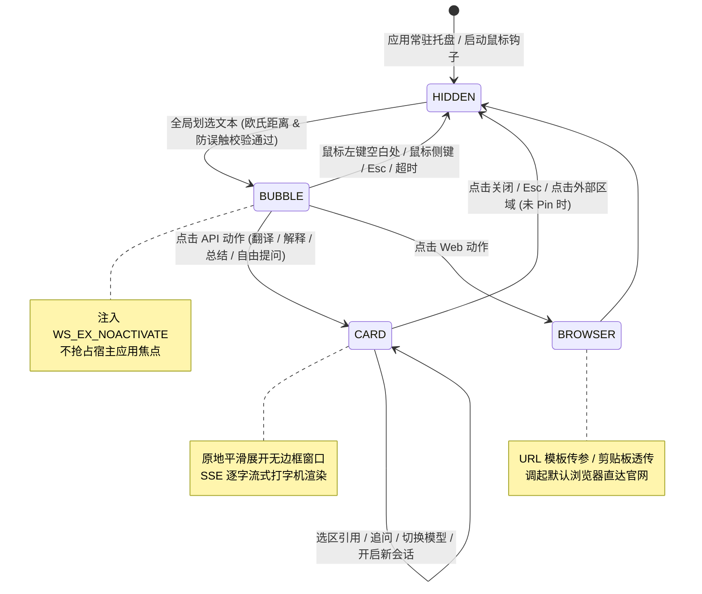

# IOX

<p align="center">
  
</p>

<p align="center">
  <strong>极速、轻量、无感侵入的 Windows 全局划词 AI 助手与桌面智能扩展</strong>
</p>

<p align="center">
  <a href="./README.md">English</a> •
  <a href="./README_zh.md"><strong>简体中文</strong></a>
</p>

<p align="center">
  <a href="https://tauri.app/"></a>
  <a href="https://www.rust-lang.org/"></a>
  <a href="https://react.dev/"></a>
  <a href="https://www.typescriptlang.org/"></a>
  <a href="https://tailwindcss.com/"></a>
  <a href="LICENSE"></a>
  
</p>

<p align="center">
  <a href="#-核心特性">核心特性</a> •
  <a href="#-系统架构">系统架构</a> •
  <a href="#-快速开始">快速开始</a> •
  <a href="#-动作与服务商配置">配置指南</a> •
  <a href="#-功能路线图">路线图</a> •
  <a href="#-开源协议">开源协议</a>
</p>

---

## 📖 简介

**IOX** 是一款专为 Windows 设计的次时代全局划词 AI 助手。基于 **Tauri v2 + Rust + React 19** 构建，以毫秒级的响应速度、极低的内存占用与无感的设计理念，将强大的大语言模型能力无缝融入你的日常阅读、编码与写作流程中。

无论是在浏览器、代码编辑器、PDF 阅读器还是办公套件中，只需划选中任意文本，IOX 即可在光标旁即刻呼出极简操作胶囊或展开流式卡片，支持原地流式问答、翻译润色、代码解释、深度思考链展示以及一键直达主流 AI 官网。

---

## ✨ 核心特性

### 🖱️ 1. 全局无感划词与极简气泡
* **即划即现**：底层基于 Windows 低级鼠标钩子（`WH_MOUSE_LL`）精准感知文本划选与释放动作，毫秒级在光标旁呈现紧凑型胶囊气泡条（Bubble Bar）。
* **纯图标无字模式**：支持一键切换为极简图标流模式，减少视觉干扰，让操作界面更加清爽灵动。
* **拖拽感知与智能避障**：根据光标位置、屏幕边界与高 DPI 缩放比例自适应调整显示位置，绝不遮挡选中文本。

### 🛡️ 2. 原生级防误触与零失焦保证 (Zero Focus Stealing)
* **`WS_EX_NOACTIVATE` 零失焦技术**：悬浮气泡弹出时注入 Windows 扩展无激活样式，**绝不抢占当前宿主程序焦点**，确保用户选中的高亮文本绝不消失、光标位置不丢失。
* **四重防误触过滤机制**：
  * **欧氏距离判定**：精准区分单纯点击与划词拖拽；
  * **有效字符与空白校验**：过滤无意义的纯空白或过短无效文本；
  * **修饰键过滤**：智能避开用户使用 `Ctrl`、`Shift`、`Alt`、`Win` 进行系统级操作的误触；
  * **智能进程黑名单**：内置黑名单过滤，支持鼠标一键框选目标程序窗口并快速加入黑名单。

### 📋 3. 零污染安全取词 (Zero-Pollution Clipboard)
* **无缝剪贴板保护**：在取词触发瞬间，IOX 先在内存中完整备份系统剪贴板，通过毫秒级模拟 `Ctrl+C` 提取高亮选区后，**立即恢复原剪贴板数据**，完全不破坏用户原有的复制粘贴历史。

### ⚡ 4. 双模动作调度引擎 (Hybrid Action Engine)
* **API 原地流式卡片模式 (In-place Streaming Card)**：
  * 基于 SSE (Server-Sent Events) 逐字流式打字机渲染；
  * **深度思考链 (DeepSeek R1 / Reasoning)**：原生支持思维链展示与折叠/展开，清晰展示 AI 的推导逻辑；
  * **全功能富文本排版**：支持 GitHub 风格 Markdown、LaTeX 数学公式渲染（KaTeX）、代码高亮与一键复制代码块；
  * **选区引用与追问**：在卡片内选中任意内容可一键添加为引用，支持多轮上下文连贯追问。
* **Web 官网直达模式 (Web Action Engine)**：
  * 支持利用动态 URL 模板（如 `https://tongyi.aliyun.com/qianwen/?q={text}`）或自动写入剪贴板调起默认浏览器；
  * 零配置复用已在浏览器登录的 DeepSeek、通义千问、Kimi、ChatGPT、Claude 等 AI 官网免费额度。

### 🎨 5. 极致质感的现代 UI/UX 体验
* **Modern Apple-grade 毛玻璃视觉**：通透的亚克力/毛玻璃质感搭配细腻的平滑阴影与微动效。
* **水滴扩散主题切换 (Dark / Light)**：基于鼠标点击坐标触发的水滴扩散与收缩动画，明暗主题无缝切换无白屏闪烁。
* **Mac 风格红绿灯标题栏**：红（关闭）、黄（收起并保留当前会话上下文）、绿（优雅全屏最大化）。
* **多标签页会话管理**：支持点击 `+` 开启新对话，标签栏支持滚轮横向滑动，右键支持关闭其他、关闭左侧、关闭右侧等便捷操作。

### 🔌 6. 开放生态与多模型聚合
* 兼容标准 **OpenAI API 格式**，支持一键接入：
  * **DeepSeek** (`deepseek-chat`, `deepseek-reasoner`)
  * **OpenAI** (`gpt-4o`, `o1`, `gpt-4o-mini`)
  * **Anthropic Claude** / **Google Gemini** (经由兼容网关)
  * **阿里云百炼 (通义千问 Qwen)**
  * **智谱 AI (GLM-4)**
  * **月之暗面 (Moonshot / Kimi)**
  * **SiliconFlow (硅基流动)**
  * **本地 Ollama / vLLM / LocalAI** (离线私有化部署)
* 提供服务商与模型级联选择、API 连通性测试与模型列表自动拉取。

### 🌐 7. 本地安全与桌面辅助
* **本地离线 JSONL 持久化**：所有历史对话与配置完整存储于用户本地 `%APPDATA%/iox` 路径，数据自主可控，隐私绝不上云。
* **桌面常驻悬浮球**：支持自由拖拽吸附、单击呼出操作面板。
* **系统托盘常驻**：支持右键菜单快速打开设置、重启划词监听或退出程序。
* **中英双语 i18n**：根据系统环境自动识别并无缝切换中英文界面。

---

## 🖼️ 界面预览

| 胶囊气泡条 (Bubble Bar) | 流式卡片与深度思考 (Streaming Card) |
| :---: | :---: |
| *划选文本后在光标旁即时呈现，支持无字图标与快捷动作* | *原地展开流式问答，支持 DeepSeek R1 思考链、公式与代码渲染* |

| 多会话与标签管理 (Multi-Tab Chat) | 设置与服务商配置 (Settings) |
| :---: | :---: |
| *支持多会话独立切换、历史记录持久化、滚轮横向滚动与右键管理* | *OpenAI 兼容协议支持、模型自动拉取、自定义 Action 提示词* |

---

## 🏗️ 系统架构

IOX 采用 **Rust 原生后端** 负责操作系统底层交互（鼠标钩子、Win32 窗口样式控制、剪贴板保护、SSE 网络通信），**React 19 + TypeScript** 负责现代化响应式界面渲染。



### 技术栈一览

| 模块 | 技术选型 | 说明 |
| :--- | :--- | :--- |
| **桌面框架** | [Tauri v2](https://v2.tauri.app/) | 极小体积、低内存占用的跨语言桌面开发框架 |
| **系统底层** | **Rust 2021**, `windows-sys` | Win32 API 封装、`WH_MOUSE_LL` 全局钩子、剪贴板保护 |
| **网络与流式** | `reqwest`, `eventsource-stream`, `tokio` | 高性能异步 HTTP 客户端与 SSE 流式事件解析 |
| **前端架构** | **React 19**, **TypeScript ~5.8**, **Vite 7** | 现代化组件开发与毫秒级热更新 |
| **样式与动效** | **Tailwind CSS v3.4**, CSS Variables | 苹果现代毛玻璃系统、水滴扩散主题动效 |
| **富文本渲染** | `react-markdown`, `remark-math`, `rehype-katex` | Markdown 标准排版、LaTeX 数学公式与代码高亮 |
| **图标与提示** | `lucide-react`, `@lobehub/icons`, `sonner` | 现代精美矢量图标与优雅吐司通知 |

---

## 🚀 快速开始

### 1. 环境准备

在开始构建 IOX 之前，请确保本地已配置以下开发环境：

* **操作系统**：Windows 10 / Windows 11 (64-bit)
* **Node.js**：`>= 18.0.0`
* **包管理器**：`pnpm` (`pnpm >= 9.0.0` 推荐)
* **Rust 工具链**：`rustc` & `cargo` (`>= 1.75.0`)，可通过 [rustup.rs](https://rustup.rs/) 安装
* **C++ 构建工具**：Visual Studio 2022 (包含 "使用 C++ 的桌面开发" 工作负载)

### 2. 获取代码与安装依赖

```powershell
# 克隆仓库
git clone https://github.com/AimAI-Labs/iox.git
cd iox

# 安装前端依赖
pnpm install
```

### 3. 本地开发与调试

```powershell
# 启动 Tauri 开发环境 (自动运行 Vite + 编译 Rust 后端 + 热重载)
pnpm tauri dev
```

### 4. 生产环境打包构建

```powershell
# 执行前端类型检查与打包，并生成 Windows 安装包及便携版 Exe
pnpm tauri build
```

打包生成的文件位于：`src-tauri/target/release/bundle/`

---

## ⚙️ 动作与服务商配置

IOX 支持高度灵活的自定义动作（Actions）与多模型服务商接入。

### 1. 自定义动作模板 (Custom Actions)

在 **设置 -> 动作管理** 中，你可以自由添加或修改划词动作：

* **API 卡片动作 (Prompt 模式)**：
  在 Prompt 中使用 `{text}` 作为选中文本的动态占位符。
  ```markdown
  你是一名资深翻译专家。请将以下选中的内容翻译为地道、流畅的中文：
  {text}
  ```
* **Web 官网直达动作 (URL 模式)**：
  在 URL 中使用 `{text}` 动态传递查询参数，例如：
  * **通义千问**：`https://tongyi.aliyun.com/qianwen/?q={text}`
  * **Google 搜索**：`https://www.google.com/search?q={text}`
  * **DeepSeek 官网**：`https://chat.deepseek.com/` (自动写入剪贴板并打开)

### 2. 服务商接入 (Provider Configuration)

IOX 原生适配所有遵循 OpenAI 标准协议的接口服务：

| 服务商 | Base URL 示例 | 推荐模型 |
| :--- | :--- | :--- |
| **DeepSeek 官方** | `https://api.deepseek.com/v1` | `deepseek-chat`, `deepseek-reasoner` |
| **OpenAI 官方** | `https://api.openai.com/v1` | `gpt-4o`, `gpt-4o-mini`, `o1` |
| **阿里云百炼 (Qwen)** | `https://dashscope.aliyuncs.com/compatible-mode/v1` | `qwen-max`, `qwen-plus`, `qwen-turbo` |
| **智谱 AI (GLM)** | `https://open.bigmodel.cn/api/paas/v4` | `glm-4-plus`, `glm-4-flash` |
| **SiliconFlow 硅基流动** | `https://api.siliconflow.cn/v1` | `deepseek-ai/DeepSeek-R1`, `Qwen/Qwen2.5-72B-Instruct` |
| **本地 Ollama** | `http://localhost:11434/v1` | `deepseek-r1:7b`, `llama3.1`, `qwen2.5` |

---

## 🗺️ 功能路线图 (Roadmap)

- [x] 全局 `WH_MOUSE_LL` 鼠标划词与紧凑胶囊气泡条 (BubbleBar)
- [x] Win32 `WS_EX_NOACTIVATE` 零失焦防闪烁保证
- [x] 内存级剪贴板自动备份与瞬时还原
- [x] OpenAI 兼容 SSE 流式输出与 DeepSeek R1 深度思考链折叠
- [x] Markdown 排版、LaTeX 数学公式与代码块一键复制
- [x] 水滴扩散全屏主题切换动效 (Dark / Light)
- [x] 多会话标签页管理与横向滚轮滑动
- [x] 本地离线 JSONL 会话持久化与导出
- [x] 常驻系统托盘与桌面快捷悬浮球
- [x] 中英文 i18n 国际化自适应
- [ ] 🖼️ 剪贴板图片感知与多模态视觉大模型识图 (GPT-4o / Qwen-VL)
- [ ] 📂 拖拽文件感知与长文档快速摘要
- [ ] 🔊 语音转文字与朗读播报支持
- [ ] 🐧 跨平台支持探索 (macOS Accessibility / Linux X11/Wayland)

---

## 🤝 参与贡献

欢迎任何形式的贡献与建议！如果你发现了 Bug 或有好的想法：

1. Fork 本项目仓库
2. 创建你的特性分支 (`git checkout -b feature/AmazingFeature`)
3. 提交你的修改 (`git commit -m 'feat: add some amazing feature'`)
4. 推送到远程分支 (`git push origin feature/AmazingFeature`)
5. 创建一个 Pull Request

---

## 📄 开源协议

本项目基于 [MIT License](LICENSE) 协议开源。可自由用于个人学习、商业使用与二次分发。
